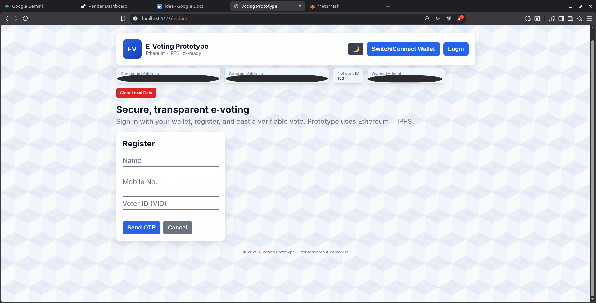
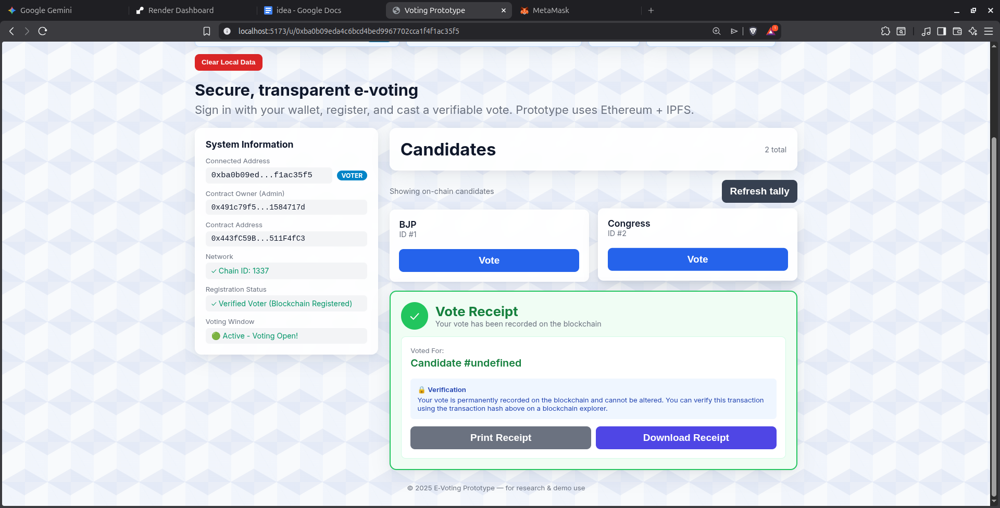
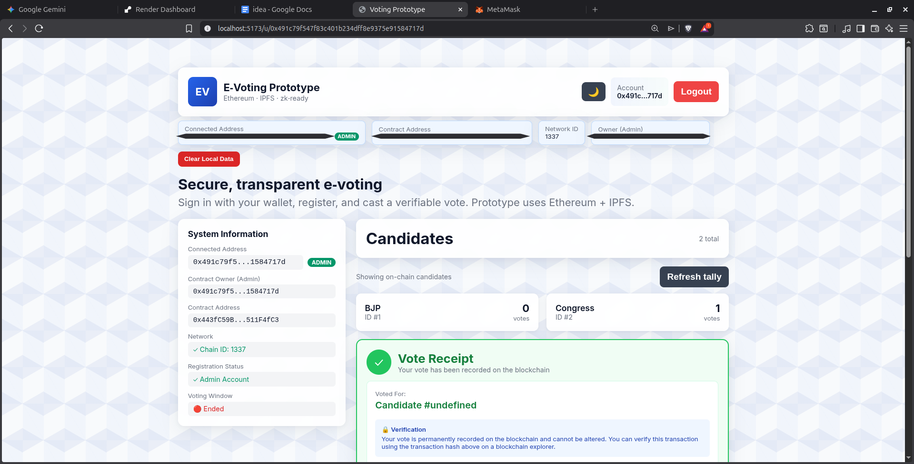
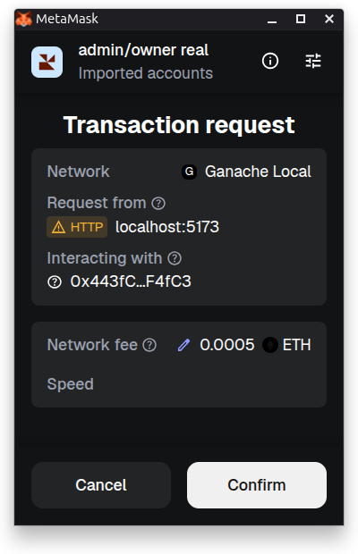
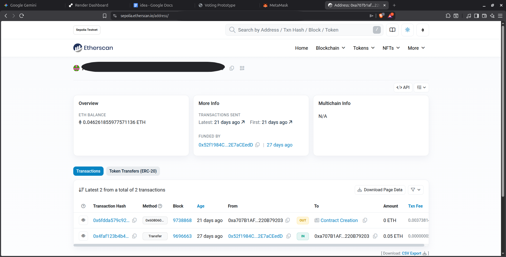

# Blockchain-based E-Voting System

A secure, decentralized e-voting system built on Ethereum. Features admin-controlled elections, voter registration, encrypted vote storage on IPFS, and MetaMask wallet integration. 

**Choose your setup:**
- 🏠 **Local Development**: Test on Ganache (local blockchain) - perfect for learning and development
- 🌐 **Production Deployment**: Deploy on Ethereum testnets/mainnet - ready for real-world use

## 🌐 Live Demo

- **Frontend**: https://voting-frontend-x6so.onrender.com/
- **Backend API**: https://blockchain-e-voting.onrender.com
- **Smart Contract**: `0xD08Bbdcb80496e4d53a0Ae769b535306Bb513716` (Sepolia)
- **Network**: Ethereum Sepolia Testnet
- **Explorer**: https://sepolia.etherscan.io/address/0xD08Bbdcb80496e4d53a0Ae769b535306Bb513716

## 📸 Screenshots

### Authentication & Wallet Connection

*MetaMask wallet integration for secure voter authentication*

### Voting Interface

*Clean, intuitive interface for casting votes on blockchain*

### Admin Dashboard

*Comprehensive admin controls for managing elections, candidates, and voters*

### Vote Receipt

*Blockchain transaction confirmation with IPFS hash for vote verification*

### Smart Contract on Explorer

*Deployed smart contract on Sepolia Etherscan showing verified transactions*

## 🏗️ Architecture

- `contracts/` - Solidity smart contract `Election.sol`
- `backend/` - Express.js API server with IPFS integration (Pinata)
- `frontend/` - React + Vite UI with MetaMask wallet connection
- `migrations/` - Contract deployment scripts
- `build/` - Compiled contract artifacts and ABIs

## ✨ Features

- 🔐 **Secure Voting**: Votes stored encrypted on IPFS, hash on blockchain
- 👤 **Admin Controls**: Add candidates, register voters, set voting periods
- 🔒 **One Vote Per Person**: Smart contract enforces single vote per address
- 📊 **Transparent Results**: Real-time vote tallying on blockchain
- 🌐 **MetaMask Integration**: Web3 wallet authentication
- ⏰ **Timed Elections**: Set start/end times for voting periods
- 🛡️ **Emergency Pause**: Admin can pause contract in emergencies

## 🚀 Getting Started

### Option A: Local Development (Recommended for Learning)

Perfect for testing and development without spending real ETH.

**Prerequisites:**
- Node.js 18+
- [Ganache](https://trufflesuite.com/ganache/) (local blockchain)
- [MetaMask](https://metamask.io/) browser extension
- [Pinata](https://pinata.cloud/) account (FREE tier)

**Setup:**

```bash
# 1. Clone repository
git clone https://github.com/mclovin22117/Blockchain-e-voting.git
cd Blockchain-e-voting

# 2. Install dependencies
npm install
cd backend && npm install
cd ../frontend && npm install
cd ..

# 3. Start Ganache
./start-ganache.sh
# Or open Ganache GUI on port 7545

# 4. Deploy smart contract locally
npx truffle migrate --reset --network development
# Note the deployed contract address

# 5. Configure environment variables
cp backend/.env.example backend/.env
cp frontend/.env.example frontend/.env

# Edit backend/.env:
# - Add your Pinata JWT token
# - Set CONTRACT_ADDRESS from step 4
# - Set FRONTEND_URL=http://localhost:5173

# Edit frontend/.env:
# - VITE_BACKEND_URL=http://localhost:3001
# - VITE_RPC_URL=http://127.0.0.1:7545
# - VITE_CONTRACT_ADDRESS=(from step 4)
# - VITE_CHAIN_ID=1337

# 6. Start backend
cd backend && npm start

# 7. Start frontend (new terminal)
cd frontend && npm start
```

**Configure MetaMask for Local:**
1. Networks → Add Network → Add Manually
2. Network Name: `Ganache Local`
3. RPC URL: `http://127.0.0.1:7545`
4. Chain ID: `1337`
5. Currency: `ETH`
6. Import Ganache account (see `GANACHE_ACCOUNTS.md` for private keys)

Visit `http://localhost:5173` - you're ready to vote locally! 🎉

---

### Option B: Production Deployment (Testnet/Mainnet)

Deploy your own instance to Ethereum network.

**Prerequisites:**
- MetaMask with testnet ETH (or mainnet ETH for production)
- [Render](https://render.com/) account (FREE tier available)
- [Pinata](https://pinata.cloud/) account

**Quick Deploy:**

See detailed guides:
- 📖 **[DEPLOY_WITH_REMIX.md](DEPLOY_WITH_REMIX.md)** - Step-by-step deployment
- 📖 **[QUICK_START.md](QUICK_START.md)** - Fast reference guide

**Summary:**
1. Deploy contract on [Remix IDE](https://remix.ethereum.org/) to Sepolia/Mainnet
2. Deploy backend to Render (connect GitHub repo, set env vars)
3. Deploy frontend to Render (static site, set env vars)
4. Update CORS between frontend/backend

**Get Testnet ETH:**
- Sepolia: https://cloud.google.com/application/web3/faucet/ethereum/sepolia
- Or use other faucets from https://faucetlink.to/sepolia

## 🔧 Environment Configuration

This project uses environment variables for configuration. The `.env.example` files show all required variables.

### Backend Environment (`backend/.env`)

```bash
# Required for both local and production
PINATA_JWT=your_jwt_token_from_pinata
CONTRACT_ADDRESS=0xYourContractAddress
NODE_ENV=development # or production
PORT=3001

# CORS Configuration
FRONTEND_URL=http://localhost:5173 # Local
# FRONTEND_URL=https://your-frontend.onrender.com # Production
```

### Frontend Environment (`frontend/.env`)

```bash
# Local Development (Ganache)
VITE_BACKEND_URL=http://localhost:3001
VITE_RPC_URL=http://127.0.0.1:7545
VITE_CONTRACT_ADDRESS=0xYourLocalContractAddress
VITE_CHAIN_ID=1337
VITE_CHAIN_NAME=Ganache Local

# Production (Sepolia Example)
# VITE_BACKEND_URL=https://your-backend.onrender.com
# VITE_RPC_URL=https://ethereum-sepolia-rpc.publicnode.com
# VITE_CONTRACT_ADDRESS=0xYourSepoliaContractAddress
# VITE_CHAIN_ID=11155111
# VITE_CHAIN_NAME=Sepolia Testnet
```

**Important**: Never commit actual `.env` files! They're gitignored for security.

## 🎯 How to Use

### Admin (Contract Owner)
1. Connect MetaMask with the wallet that deployed the contract
2. Access admin panel (automatically appears for owner)
3. **Add Candidates**: Enter candidate names
4. **Register Voters**: Add voter wallet addresses (one per line)
5. **Set Voting Period**: Choose start/end times (Unix timestamps)
6. **Monitor Results**: Real-time vote counts displayed

### Voters
1. **Get Registered**: Admin must add your wallet address
2. **Connect Wallet**: Click "Connect Wallet" and approve MetaMask
3. **Login**: System verifies you're registered
4. **Cast Vote**: Select candidate and confirm transaction
5. **View Receipt**: Get IPFS hash of encrypted vote for verification

## 📁 Project Structure

```
Blockchain-e-voting/
├── contracts/           # Solidity smart contracts
│   ├── Election.sol     # Main voting contract
│   └── Migrations.sol   # Truffle migrations
├── backend/             # Express.js API server
│   ├── index.js         # Server + IPFS integration
│   ├── ipfs.js          # Pinata IPFS functions
│   └── .env.example     # Environment template
├── frontend/            # React + Vite UI
│   ├── src/
│   │   ├── App.jsx      # Main component
│   │   ├── config.js    # Web3 configuration
│   │   └── components/  # UI components
│   └── .env.example     # Environment template
├── migrations/          # Truffle deployment scripts
├── build/               # Compiled contract artifacts
├── Election.abi.json    # Contract ABI (for reference)
└── *.md                 # Documentation files
```

## 📚 Documentation

- **[QUICK_START.md](QUICK_START.md)** - Fast setup reference (local + production)
- **[DEPLOY_WITH_REMIX.md](DEPLOY_WITH_REMIX.md)** - Deploy contract with Remix IDE
- **[DEVELOPMENT_WORKFLOW.md](DEVELOPMENT_WORKFLOW.md)** - Local development guide
- **[IPFS_SETUP.md](IPFS_SETUP.md)** - IPFS/Pinata configuration
- **[GANACHE_ACCOUNTS.md](GANACHE_ACCOUNTS.md)** - Test account private keys
- **[SMART_CONTRACT_FLOWCHART.md](SMART_CONTRACT_FLOWCHART.md)** - Contract architecture diagrams
- **[TOOLS_TECHNOLOGIES.md](TOOLS_TECHNOLOGIES.md)** - Complete tech stack reference

## 🛡️ Security Features

- ✅ OpenZeppelin contracts (Pausable, ReentrancyGuard)
- ✅ Voting periods with emergency pause
- ✅ Rate limiting (100 req/15min per IP)
- ✅ Input validation (Joi schemas)
- ✅ Helmet.js security headers
- ✅ CORS whitelist
- ✅ Address validation (prevent addresses as candidate names)
- ✅ One vote per address enforced on-chain

## 🔍 Contract Details

**Production Contract (Sepolia Testnet):**
- **Address**: `0xD08Bbdcb80496e4d53a0Ae769b535306Bb513716`
- **Network**: Ethereum Sepolia Testnet
- **Compiler**: Solidity ^0.8.20
- **Etherscan**: https://sepolia.etherscan.io/address/0xD08Bbdcb80496e4d53a0Ae769b535306Bb513716

**Local Development:**
- Deploy your own contract on Ganache using `npx truffle migrate --reset --network development`
- Use the deployed address in your local `.env` files

## 🧪 Testing

**Local Testing:**
```bash
# Start Ganache
./start-ganache.sh

# Deploy contract
npx truffle migrate --reset --network development

# Run application
npm run start:all
```

**Production Testing:**
1. Visit live demo: https://voting-frontend-x6so.onrender.com/
2. Connect MetaMask to Sepolia
3. Get test ETH from faucet
4. Test the voting flow

## ⚙️ Technology Stack

### Blockchain
- **Ethereum** - Decentralized blockchain platform
- **Solidity ^0.8.20** - Smart contract language
- **OpenZeppelin** - Secure contract libraries (Pausable, ReentrancyGuard)
- **Truffle** - Development framework (local only)
- **Ganache** - Local blockchain for testing

### Backend
- **Node.js** - JavaScript runtime
- **Express.js** - Web server framework
- **Pinata** - IPFS pinning service
- **Joi** - Input validation
- **Helmet.js** - Security headers
- **express-rate-limit** - Rate limiting

### Frontend
- **React 18** - UI library
- **Vite** - Build tool
- **ethers.js** - Ethereum library
- **MetaMask** - Web3 wallet

### Deployment
- **Remix IDE** - Contract deployment
- **Render** - Application hosting (free tier)

## 🤝 Contributing

Contributions are welcome! Whether you're fixing bugs, improving documentation, or adding new features.

**How to contribute:**
1. Fork the repository
2. Create feature branch (`git checkout -b feature/AmazingFeature`)
3. Make your changes
4. Test locally on Ganache
5. Commit changes (`git commit -m 'Add AmazingFeature'`)
6. Push to branch (`git push origin feature/AmazingFeature`)
7. Open Pull Request

**Guidelines:**
- Follow existing code style
- Test changes thoroughly
- Update documentation as needed
- Keep commits atomic and descriptive

## 📝 License

This project is for educational and research purposes. Use at your own risk.

## ⚠️ Important Notes

- **Testnet vs Mainnet**: This demo runs on Sepolia testnet. For production mainnet:
  - Conduct thorough security audits
  - Comprehensive testing
  - Gas optimization
  - Professional security review
- **Free Tier Limitations**: Render free tier has cold starts (30-60s wake time)
- **Security**: Never share private keys, seed phrases, or API tokens
- **Environment Variables**: Always use `.env` files (never commit them!)

## 🙏 Acknowledgments

- **OpenZeppelin** - Secure smart contract libraries
- **Pinata** - IPFS storage infrastructure  
- **Render** - Free hosting services
- **MetaMask** - Web3 wallet integration
- **Ethereum Foundation** - Blockchain platform

## 📧 Contact & Support

- **Issues**: https://github.com/mclovin22117/Blockchain-e-voting/issues
- **Discussions**: https://github.com/mclovin22117/Blockchain-e-voting/discussions

## 📄 License

This project is licensed under the MIT License - see the [LICENSE](LICENSE) file for details.

---

**Made with ❤️ for transparent and secure voting**

