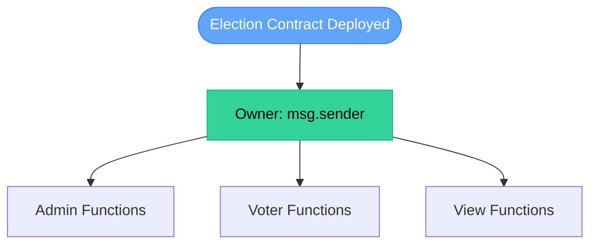
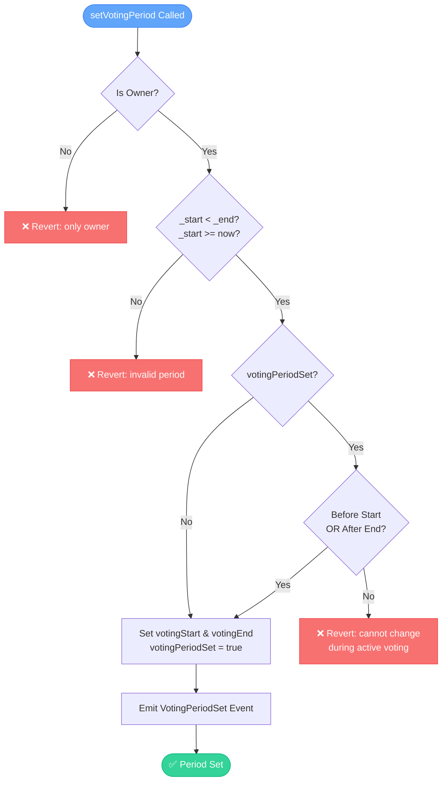
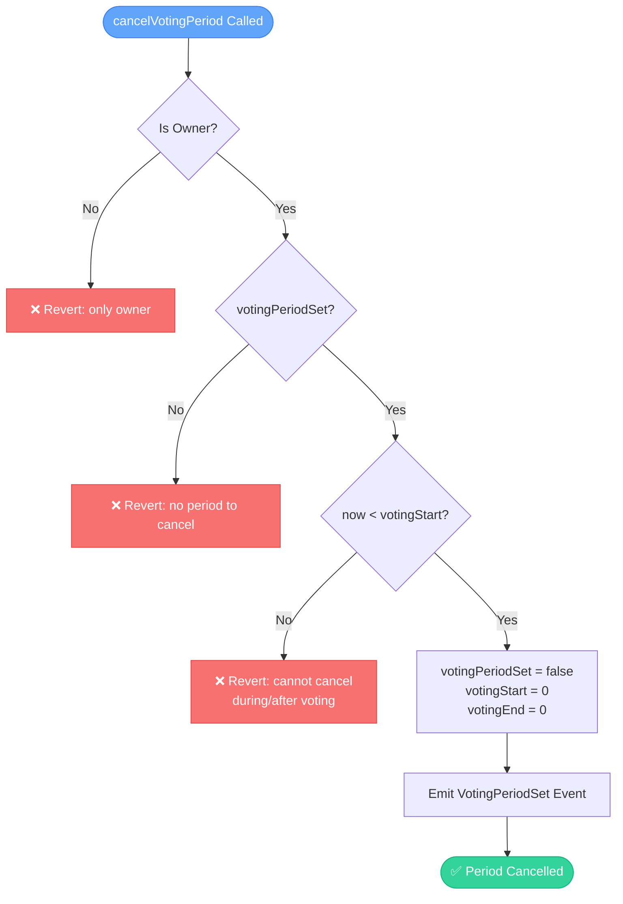
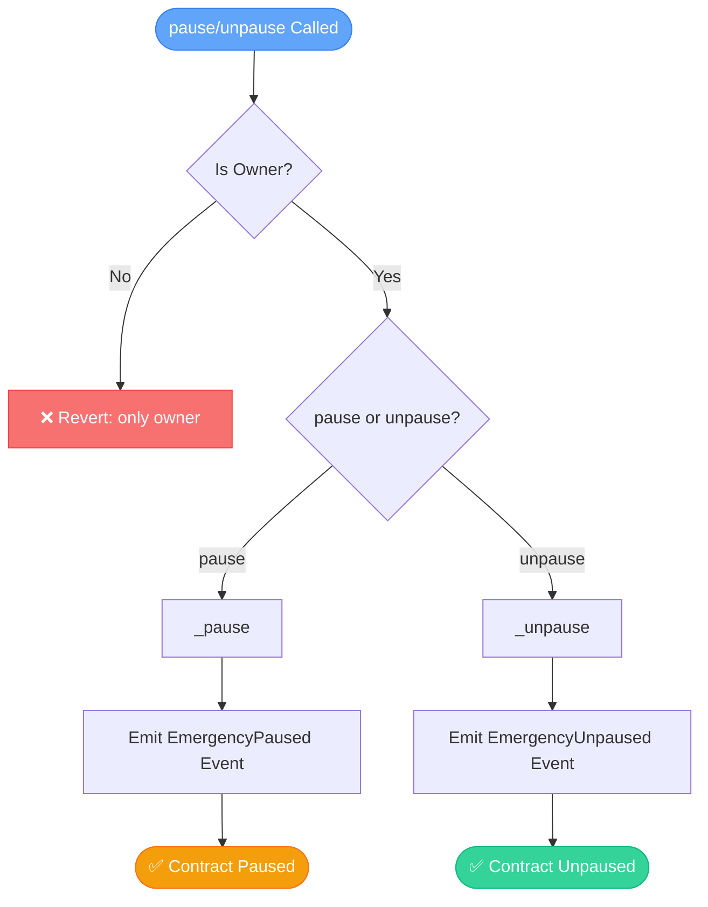
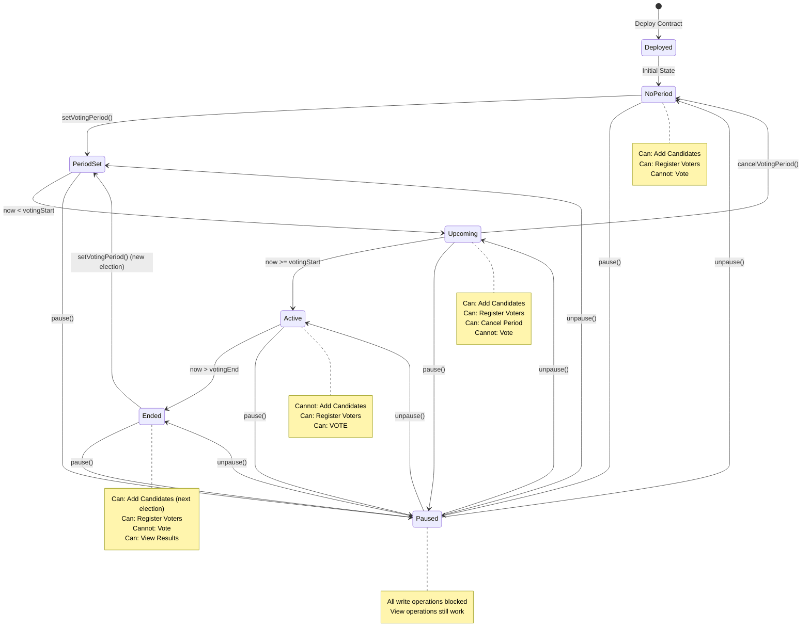
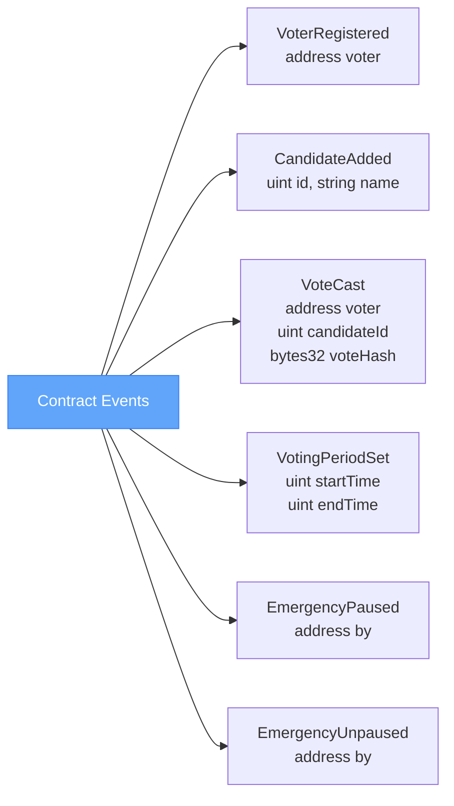
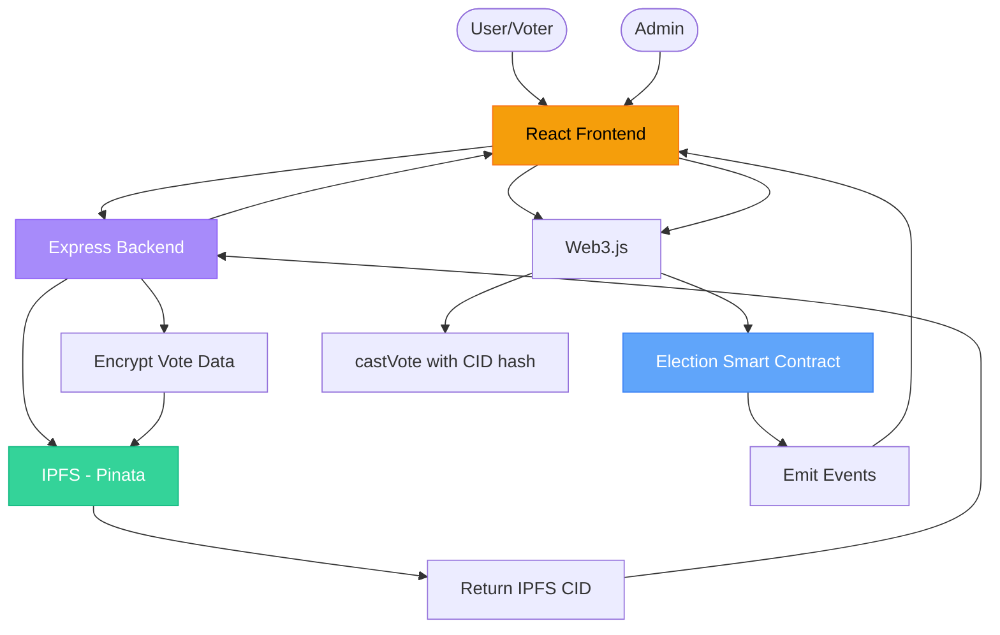

# Election Smart Contract Flowchart

## Contract Architecture Overview



---

## 1. Contract Initialization Flow


**Initial State:**
- `candidatesCount = 0`
- `votingPeriodSet = false`
- `votingStart = 0`
- `votingEnd = 0`

---

## 2. Voting Period Management Flow



### Cancel Voting Period Flow



---

## 3. Candidate Management Flow

```mermaid
graph TB
    Start([addCandidate Called])
    Start --> CheckOwner{Is Owner?}
    CheckOwner -->|No| RevertOwner[❌ Revert: only owner]
    CheckOwner -->|Yes| CheckPaused{Contract Paused?}
    
    CheckPaused -->|Yes| RevertPaused[❌ Revert: paused]
    CheckPaused -->|No| ValidateName{Valid Name?<br/>length > 0<br/>length <= 100<br/>not an address}
    
    ValidateName -->|No| RevertInvalid[❌ Revert: invalid name]
    ValidateName -->|Yes| CheckPeriodSet{votingPeriodSet?}
    
    CheckPeriodSet -->|No| AddCandidate[candidatesCount++<br/>Create Candidate Struct]
    CheckPeriodSet -->|Yes| CheckTiming{Before Start<br/>OR After End?}
    
    CheckTiming -->|No| RevertActive[❌ Revert: cannot add<br/>during active voting]
    CheckTiming -->|Yes| AddCandidate
    
    AddCandidate --> StoreCandidate[candidates[candidatesCount] = Candidate]
    StoreCandidate --> EmitEvent[Emit CandidateAdded Event]
    EmitEvent --> Success([✅ Candidate Added])
    
    style Start fill:#60a5fa,stroke:#3b82f6,color:#fff
    style Success fill:#34d399,stroke:#10b981,color:#fff
    style RevertOwner fill:#f87171,stroke:#ef4444,color:#fff
    style RevertPaused fill:#f87171,stroke:#ef4444,color:#fff
    style RevertInvalid fill:#f87171,stroke:#ef4444,color:#fff
    style RevertActive fill:#f87171,stroke:#ef4444,color:#fff
```

---

## 4. Voter Registration Flow

```mermaid
graph TB
    Start([registerVoter Called])
    Start --> CheckOwner{Is Owner?}
    CheckOwner -->|No| RevertOwner[❌ Revert: only owner]
    CheckOwner -->|Yes| CheckPaused{Contract Paused?}
    
    CheckPaused -->|Yes| RevertPaused[❌ Revert: paused]
    CheckPaused -->|No| CheckValid{Valid Address?<br/>!= 0x0<br/>!= owner<br/>!registered}
    
    CheckValid -->|No| RevertInvalid[❌ Revert: invalid/<br/>already registered/<br/>owner cannot vote]
    CheckValid -->|Yes| Register[registered[_voter] = true]
    
    Register --> EmitEvent[Emit VoterRegistered Event]
    EmitEvent --> Success([✅ Voter Registered])
    
    style Start fill:#60a5fa,stroke:#3b82f6,color:#fff
    style Success fill:#34d399,stroke:#10b981,color:#fff
    style RevertOwner fill:#f87171,stroke:#ef4444,color:#fff
    style RevertPaused fill:#f87171,stroke:#ef4444,color:#fff
    style RevertInvalid fill:#f87171,stroke:#ef4444,color:#fff
```

---

## 5. Voting Flow (Core Function)

```mermaid
graph TB
    Start([castVote Called])
    Start --> CheckRegistered{Is Registered?}
    CheckRegistered -->|No| RevertNotReg[❌ Revert: not registered]
    CheckRegistered -->|Yes| CheckPeriodSet{votingPeriodSet?}
    
    CheckPeriodSet -->|No| RevertNoPeriod[❌ Revert: voting period not set]
    CheckPeriodSet -->|Yes| CheckStarted{now >= votingStart?}
    
    CheckStarted -->|No| RevertNotStarted[❌ Revert: voting not started]
    CheckStarted -->|Yes| CheckEnded{now <= votingEnd?}
    
    CheckEnded -->|No| RevertEnded[❌ Revert: voting ended]
    CheckEnded -->|Yes| CheckPaused{Contract Paused?}
    
    CheckPaused -->|Yes| RevertPaused[❌ Revert: paused]
    CheckPaused -->|No| CheckReentrancy{Reentrancy Guard}
    
    CheckReentrancy -->|Active| RevertReentrant[❌ Revert: reentrant call]
    CheckReentrancy -->|Pass| ValidateVote{Valid Candidate?<br/>Valid Hash?<br/>!hasVoted?}
    
    ValidateVote -->|No| RevertInvalid[❌ Revert: invalid candidate/<br/>invalid hash/<br/>already voted]
    ValidateVote -->|Yes| RecordVote[hasVoted[voter] = true<br/>votes[voter] = candidateId<br/>voteHashes[voter] = voteHash]
    
    RecordVote --> IncrementCount[candidates[candidateId].voteCount++]
    IncrementCount --> EmitEvent[Emit VoteCast Event]
    EmitEvent --> Success([✅ Vote Cast])
    
    style Start fill:#60a5fa,stroke:#3b82f6,color:#fff
    style Success fill:#34d399,stroke:#10b981,color:#fff
    style RevertNotReg fill:#f87171,stroke:#ef4444,color:#fff
    style RevertNoPeriod fill:#f87171,stroke:#ef4444,color:#fff
    style RevertNotStarted fill:#f87171,stroke:#ef4444,color:#fff
    style RevertEnded fill:#f87171,stroke:#ef4444,color:#fff
    style RevertPaused fill:#f87171,stroke:#ef4444,color:#fff
    style RevertReentrant fill:#f87171,stroke:#ef4444,color:#fff
    style RevertInvalid fill:#f87171,stroke:#ef4444,color:#fff
```

---

## 6. Emergency Controls Flow



**Effect of Pause:**
- `addCandidate()` → Blocked
- `registerVoter()` → Blocked  
- `castVote()` → Blocked
- View functions → Still work

---

## 7. View Functions Flow

```mermaid
graph LR
    GetCandidate([getCandidate id]) --> ReturnData[Return id, name, voteCount]
    
    Tally([tally]) --> BuildArrays[Build ids & counts arrays]
    BuildArrays --> LoopCandidates[Loop through candidatesCount]
    LoopCandidates --> ReturnArrays[Return ids[], counts[]]
    
    style GetCandidate fill:#60a5fa,stroke:#3b82f6,color:#fff
    style Tally fill:#60a5fa,stroke:#3b82f6,color:#fff
```

**Public View Variables:**
- `owner`
- `candidatesCount`
- `candidates[id]`
- `registered[address]`
- `hasVoted[address]`
- `votes[address]`
- `voteHashes[address]`
- `votingStart`
- `votingEnd`
- `votingPeriodSet`

---

## 8. Complete State Machine Diagram



---

## 9. Security Features & Modifiers

```mermaid
graph TB
    Function([Function Called]) --> Modifiers[Apply Modifiers]
    
    Modifiers --> OnlyOwner{onlyOwner?}
    OnlyOwner -->|Yes| CheckOwner{msg.sender == owner?}
    CheckOwner -->|No| Revert1[❌ Revert]
    CheckOwner -->|Yes| OnlyRegistered{onlyRegistered?}
    OnlyOwner -->|No| OnlyRegistered
    
    OnlyRegistered -->|Yes| CheckReg{registered[msg.sender]?}
    CheckReg -->|No| Revert2[❌ Revert]
    CheckReg -->|Yes| DuringPeriod{duringVotingPeriod?}
    OnlyRegistered -->|No| DuringPeriod
    
    DuringPeriod -->|Yes| CheckPeriod{votingPeriodSet &&<br/>now >= votingStart &&<br/>now <= votingEnd?}
    CheckPeriod -->|No| Revert3[❌ Revert]
    CheckPeriod -->|Yes| WhenNotPaused{whenNotPaused?}
    DuringPeriod -->|No| WhenNotPaused
    
    WhenNotPaused -->|Yes| CheckPaused{!paused?}
    CheckPaused -->|No| Revert4[❌ Revert]
    CheckPaused -->|Yes| NonReentrant{nonReentrant?}
    WhenNotPaused -->|No| NonReentrant
    
    NonReentrant -->|Yes| CheckReentrancy{Reentrancy Guard}
    CheckReentrancy -->|Fail| Revert5[❌ Revert]
    CheckReentrancy -->|Pass| Execute[Execute Function]
    NonReentrant -->|No| Execute
    
    Execute --> Success([✅ Success])
    
    style Function fill:#60a5fa,stroke:#3b82f6,color:#fff
    style Success fill:#34d399,stroke:#10b981,color:#fff
    style Revert1 fill:#f87171,stroke:#ef4444,color:#fff
    style Revert2 fill:#f87171,stroke:#ef4444,color:#fff
    style Revert3 fill:#f87171,stroke:#ef4444,color:#fff
    style Revert4 fill:#f87171,stroke:#ef4444,color:#fff
    style Revert5 fill:#f87171,stroke:#ef4444,color:#fff
```

---

## 10. Data Storage Structure

```mermaid
graph TB
    Storage[Contract Storage]
    
    Storage --> SimpleVars[Simple Variables]
    Storage --> Mappings[Mappings]
    Storage --> Struct[Struct: Candidate]
    
    SimpleVars --> owner[owner: address]
    SimpleVars --> candidatesCount[candidatesCount: uint]
    SimpleVars --> votingStart[votingStart: uint]
    SimpleVars --> votingEnd[votingEnd: uint]
    SimpleVars --> votingPeriodSet[votingPeriodSet: bool]
    
    Mappings --> candidates[candidates: uint => Candidate]
    Mappings --> registered[registered: address => bool]
    Mappings --> hasVoted[hasVoted: address => bool]
    Mappings --> votes[votes: address => uint]
    Mappings --> voteHashes[voteHashes: address => bytes32]
    
    Struct --> id[id: uint]
    Struct --> name[name: string]
    Struct --> voteCount[voteCount: uint]
    
    style Storage fill:#60a5fa,stroke:#3b82f6,color:#fff
    style SimpleVars fill:#34d399,stroke:#10b981,color:#000
    style Mappings fill:#f59e0b,stroke:#f97316,color:#000
    style Struct fill:#a78bfa,stroke:#8b5cf6,color:#fff
```



---

## 11. Events Emitted



---

## 12. Function Access Control Matrix

| Function | Owner Only | Registered Only | During Voting | Not Paused | Non-Reentrant |
|----------|-----------|----------------|---------------|-----------|---------------|
| `setVotingPeriod()` | ✅ | ❌ | ❌ | ❌ | ❌ |
| `cancelVotingPeriod()` | ✅ | ❌ | ❌ | ❌ | ❌ |
| `addCandidate()` | ✅ | ❌ | ❌ | ✅ | ❌ |
| `registerVoter()` | ✅ | ❌ | ❌ | ✅ | ❌ |
| `pause()` | ✅ | ❌ | ❌ | ❌ | ❌ |
| `unpause()` | ✅ | ❌ | ❌ | ❌ | ❌ |
| `castVote()` | ❌ | ✅ | ✅ | ✅ | ✅ |
| `getCandidate()` | ❌ | ❌ | ❌ | ❌ | ❌ |
| `tally()` | ❌ | ❌ | ❌ | ❌ | ❌ |

---

## 13. Integration with Off-Chain Systems



---

## Summary

### Key Features:
- ✅ **Flexible Voting Periods**: Can be set, modified, or cancelled
- ✅ **Security**: Pausable, ReentrancyGuard, owner controls
- ✅ **Transparency**: All votes recorded with IPFS hashes
- ✅ **One Vote Per Voter**: Strict enforcement via `hasVoted` mapping
- ✅ **Multi-Election Support**: Can schedule new elections after previous ends
- ✅ **Owner Cannot Vote**: Prevents admin bias
- ✅ **Time-Based Access Control**: Functions gated by voting period status

### OpenZeppelin Integrations:
1. **Pausable**: Emergency stop mechanism
2. **ReentrancyGuard**: Protects against reentrancy attacks in `castVote()`

### Gas Optimization:
- Solidity 0.8.19 with optimizer enabled (200 runs)
- Efficient storage layout
- Minimal loops in tally function
